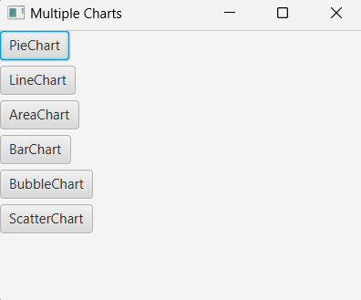
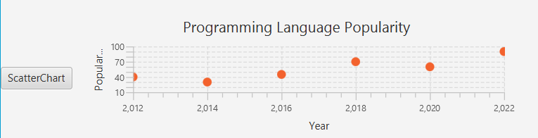

# Simple Java | JavaFx Charts

__IDE: IntelliJ IDEA__

## Learning:
The primary feature of Java showcased in this code is JavaFX, which is used for creating graphical user interfaces (GUIs). Specifically, the code demonstrates the use of several key aspects of JavaFX:

#### JavaFX Application Structure: 
The class HelloApplication extends the Application, and the start method is overridden to set up the stage and scene, which are core components of a JavaFX application.

#### JavaFX Components: 
Various JavaFX UI components are utilized, such as:

1. Button
2. PieChart, LineChart, AreaChart, BarChart, BubbleChart, ScatterChart
3. GridPane for layout management
4. ScrollPane for adding scrolling capability to the GridPane
5. Scene and Stage for managing the display window.
#### Event Handling: 
The code uses event handling to respond to button clicks.

#### Chart Data: 
Various types of charts are populated with data using XYChart.

#### Layouts and Positioning: 
The GridPane layout is used to arrange buttons and charts in a grid.

#### ScrollPane: 
The ScrollPane wraps the GridPane, enabling scrolling when the content exceeds the visible area.

**Screenshot (Charts List):**

**Screenshot (Charts):**

